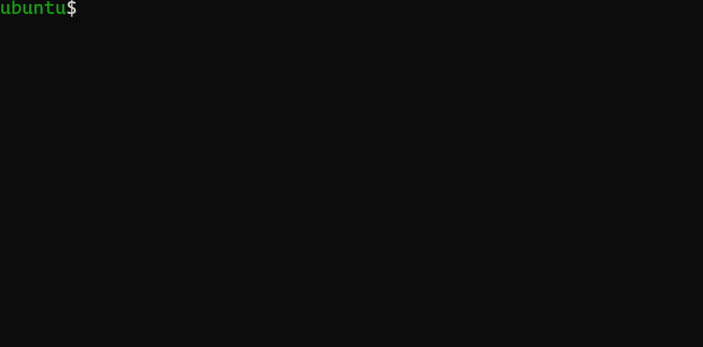

# Tsuquo

Tsuquo compiles a regular expression to a minimal deterministic finite
automaton. The final DFA is represented as a Graphviz dot file. The name comes
from the steps involved: ***T***hompson's construction, ***su***bset
construction, and ***quo***tient construction.


# Demo



# Supported Regexes

Currently, tsuquo can support the following:
* ASCII characters
* Quantifiers `* ? +`
* Parentheses `()`
* Alternations `|`
* Escape sequences `\(` `\)` `\[` `\]` `\*` `\?` `\+` `\|` `\n` `\t` `\\`
* Ranges `[a-z0-9!@#]`
  * In a range, all special characters must still be escaped, e.g. `[\[-\]]`
  * To match `-` in a range, put it as the first character, e.g. `[-abc]`

Tsuquo **cannot** support the following:
* Wildcard `.`
  * It SOMETIMES works, but it may crash the program. Try at your own risk.
* Negation `^`


# Building

## Requirements

* make
* Graphviz: https://graphviz.org/download/

## Steps

1. Go to the root project directory. On Linux, run `make`. On Windows, run
`build.bat`.

    * Windows will build both the release binary and the debug binary. Linux
    requires you to run `make debug` if you want the debug binary.
    * `gcc` is the default. To change it, run `make CC=yourcompiler`. (Sorry,
    can't change it on Windows.)

2. Type a regular expression into a text file and save it. Try the ones in
`examples/`!

    * _LITERAL NEWLINES ARE IGNORED._ If you have a file like:
```
abc
def|

lol
```
This will be parsed as `abcdef|lol`. See `examples/c_tokens.txt` for a
self-explanatory justification.

3. Run `./main your_regex_file.txt` or `main.exe your_regex_file.txt`. A `.dot`
file will be generated in `dots/`.

4. Run `./convert.sh` to automatically convert all files in `dots/` to `.svg`s
(default). To specify a different image type, supply the extension as an
argument, e.g. `./convert.sh png`. All images are saved in `saves/`. (Sorry,
there's no Windows batch script for converting yet.)

    * Supported image extensions are: `.svg` `.png` `.jpg` `.jpeg`
    * Known issue on Linux: after cloning the repo, the `.sh` files lose their
    executable mode. For now, run `chmod +x whatever_file.sh` to fix this.

5. If you want to clean the binaries: on Linux, run `make clean` to purge the
release binary and object files. Run `make deepclean` to purge everything. On
Windows, run `clean.bat` to purge everything.


# Unit Tests

Unit testing is done with the Unity framework:
https://github.com/ThrowTheSwitch/Unity

All required files are already included in `unity/`. Just navigate to any
test directory and run `make`. (Sorry, no Windows support for unit tests.)


# TODO

* add support for matchall `.` and negation `[^a]`
* fix bug when cloning a `.sh` file (see step 4 from Building section). The file
also shows up as modified in `git status`